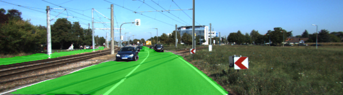
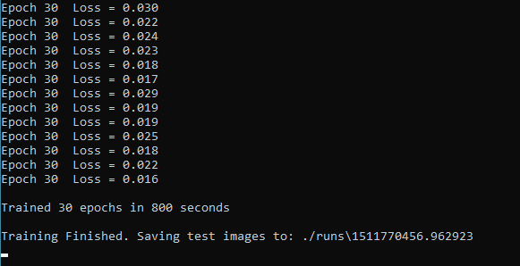

# Self-Driving Car Engineer Nanodegree Program
## Semantic Segmentation - Project 2

<p align="center">
    
</p>

## Introduction

The goal of this project is to build a Fully Convolutional Neural Network based on the model originally created by Oxford's Visual Geometry Group (VGG). The FCN is trained on the **`Kitti Road dataset`** provided by `www.cvlibs.net`. The FCN is then used to label pixels in images as either road (green pixels) or not road (default pixels). 

## Trainng the FCN

The FCN consists of two classes - "road" and "not road", `tf.truncated_normal_initializer` with a scalar of 0.01 is used for kernel initialization and `tf.contrib.layers.l2_regularizer` with a scale of 0.001 is used for kernel regularization. 

```
    # 1x1 convolution of layer 7
    conv_7 = tf.layers.conv2d(
        vgg_layer7_out, num_classes, 1, 1, 'SAME',
        kernel_initializer = tf.truncated_normal_initializer(stddev=0.01),
        kernel_regularizer = tf.contrib.layers.l2_regularizer(0.001))
  
    # Upsampling output of 1x1 convolution
    deconv_4 = tf.layers.conv2d_transpose(
        conv_7, num_classes, 4, 2, 'SAME',
        kernel_initializer = tf.truncated_normal_initializer(stddev=0.01),
        kernel_regularizer = tf.contrib.layers.l2_regularizer(0.001))
    
    # 1x1 convolution of layer 4
    conv_4 = tf.layers.conv2d(
        vgg_layer4_out, num_classes, 1, 1, 'SAME',
        kernel_initializer=tf.truncated_normal_initializer(stddev=0.01), 
        kernel_regularizer=tf.contrib.layers.l2_regularizer(0.001))

    # skip connection
    skip_1 = tf.add(deconv_4, conv_4)
    # Upsample
    deconv_3 = tf.layers.conv2d_transpose(
        skip_1, num_classes, 4, 2, 'SAME', 
        kernel_initializer=tf.truncated_normal_initializer(stddev=0.01),
        kernel_regularizer= tf.contrib.layers.l2_regularizer(0.001))

    # 1x1 convolution of layer 3
    conv_3 = tf.layers.conv2d(
        vgg_layer3_out, num_classes, 1, 1, 'SAME',
        kernel_initializer=tf.truncated_normal_initializer(stddev=0.01),
        kernel_regularizer= tf.contrib.layers.l2_regularizer(0.001))
    
    # Skip connection
    skip_2 = tf.add(deconv_3, conv_3)
    # Upsample
    deconv_3 = tf.layers.conv2d_transpose(
        skip_2, num_classes, 16, 8, 'SAME', 
        kernel_initializer=tf.truncated_normal_initializer(stddev=0.01),
        kernel_regularizer= tf.contrib.layers.l2_regularizer(0.001))

    return deconv_3
```

Keep_probabilty is set to 0.5 to prevent overfitting and the learing rate is set to 0.0001. After some trial and error i have settled on 30 epochs with a batch size of 5 (trained in 800 seconds with the trainig loss of 0.023 by the last epoch).

<p align="center">
    
</p>


### Setup
##### Frameworks and Packages
Make sure you have the following is installed:
 - [Python 3](https://www.python.org/)
 - [TensorFlow](https://www.tensorflow.org/)
 - [NumPy](http://www.numpy.org/)
 - [SciPy](https://www.scipy.org/)
##### Dataset
Download the [Kitti Road dataset](http://www.cvlibs.net/datasets/kitti/eval_road.php) from [here](http://www.cvlibs.net/download.php?file=data_road.zip).  Extract the dataset in the `data` folder.  This will create the folder `data_road` with all the training a test images.

### Start
##### Implement
Implement the code in the `main.py` module indicated by the "TODO" comments.
The comments indicated with "OPTIONAL" tag are not required to complete.
##### Run
Run the following command to run the project:
```
python main.py
```
**Note** If running this in Jupyter Notebook system messages, such as those regarding test status, may appear in the terminal rather than the notebook.

### Submission
1. Ensure you've passed all the unit tests.
2. Ensure you pass all points on [the rubric](https://review.udacity.com/#!/rubrics/989/view).
3. Submit the following in a zip file.
 - `helper.py`
 - `main.py`
 - `project_tests.py`
 - Newest inference images from `runs` folder  (**all images from the most recent run**)
 
 ## How to write a README
A well written README file can enhance your project and portfolio.  Develop your abilities to create professional README files by completing [this free course](https://www.udacity.com/course/writing-readmes--ud777).
